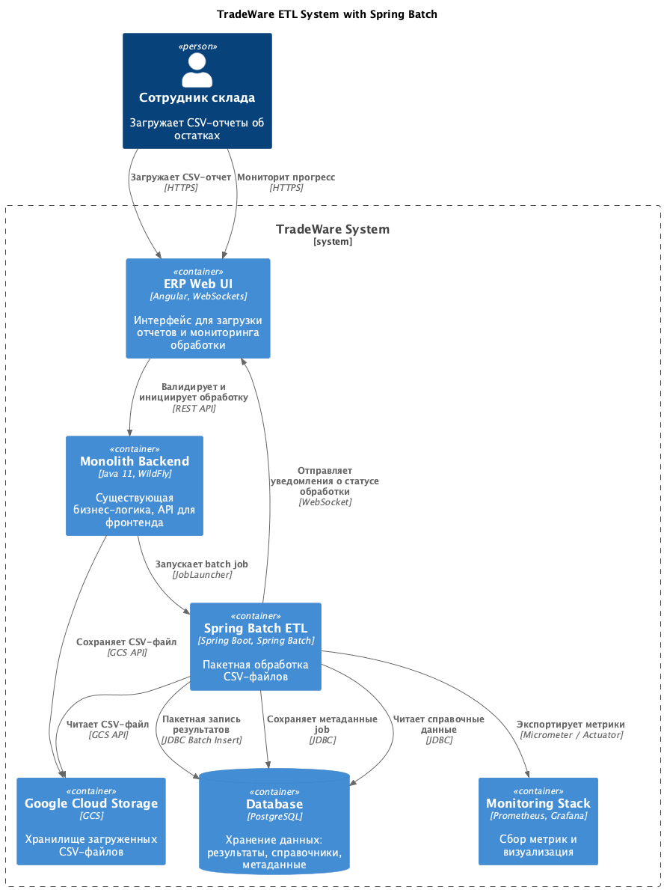

# ADR: Внедрение Spring Batch для пакетной обработки данных

Внедрение ETL-решения для обработки больших объемов данных по складским остаткам.

Автор: Кудрин О.А.

Дата: 2025-11-17

## Контекст

### Проблемы

- Пиковая нагрузка: до 400 тыс. строк в сутки, в перспективе еще больше.
- Построчная обработка: каждая запись обрабатывается отдельно в онлайн-режиме, что перегружает базу данных
- Отсутствие механизмов повторов: при ошибках весь процесс падает
- Нет мониторинга: невозможно отследить прогресс обработки и узкие места
- Блокировки: один поток данных тормозит остальные
- Требования производительности: обработка 2000 строка за 30 сек., поддержка 100-150 параллельных загрузок

### Функциональные требования

| N   | Действующие лица | Use Case            | Описание                                                               |
| --- | ---------------- | ------------------- | ---------------------------------------------------------------------- |
| 1   | Сотрудник склада | Загрузка CSV-отчета | Пользователь загружает CSV с остатками через интерфейс                 |
| 2   | ETL-система      | Валидация данных    | Проверка формата и целостности данных                                  |
| 3   | ETL-система      | Обогащение данных   | Обновление данными из справочников (программа лояльности, промо-акции) |
| 4   | ETL-система      | Сохранение в БД     | Пакетная загрузка обработанных данных в PostgreSQL                     |
| 5   | ETL-система      | Обработка ошибок    | Повторы при временных сбоях, логирование ошибок                        |

### Нефункциональные требования

| N   | Требование                                                                         |
| --- | ---------------------------------------------------------------------------------- |
| 1   | Производительность: обработка 2000 строка за не более чем 30 сек.                  |
| 2   | Масштабируемость: поддержка 100-150 параллельных загрузок в пиковые часы           |
| 3   | Надежность: механизмы повторов и перезапуска при сбоях                             |
| 4   | Мониторинг: отслеживание прогресса обработки, метрики производительности           |
| 5   | Транзакционность: обработка порциями (chunk-based) с возможность отката (rollback) |
| 6   | Интеграция: совместимость с экосистемой Java и будущей микросервисной архитектурой |

## Решение

Выбираем **Spring Batch**, инструмент для пакетной обработки данных, который решает все выявленные проблемы.

### Ключевые преимущества

1. Chunk-oriented processing
    - Обработка данных порциями вместо отдельных строк
    - Оптимизация транзакций, commit на порцию, а не на строкsу
    - Настраиваемый размер порции для балансировки производительности и надежности

2. Встроенная отказоустойчивость
    - Skip: пропуск невалидных записей без остановки задания
    - Retry: автоматические повторы при временных сбоях
    - Restart: возобновление с точки остановки при падении

3. Мониторинг и метрики
    - JobRepository: хранение метаданных о выполении заданий
    - Метрики: количество прочитанных, обработканных, записанных строк, время выполнения
    - Интеграция с Spring Book Actuator и Micrometer для экспорта в Prometheus / Grafana

4. Масштабируемость
    - Partitioning: разделение данных на партиции для параллельной обработки
    - Multi-threading: параллельное выполнение шагов
    - Remote chunking: распределение обработки между узлами

5. Интеграция с экосистемой
    - Нативная поддержка Spring Framework
    - Готовые читатели и писателя для CSV, XML, JSON, JDBC, JPA
    - Легкая интеграция с Spring Cloud для микросервисов

### Архитектура

## Альтернативы

Отвергнуты более громоздкие и избыточные инструменты:

- Apache Airflow
- Apache Spark

Относительно молодые проекты без должной экосистемы:

- JobRunr
- EasyBatch

А также Custom решение, которое потребует реализации всего с нуля.

## Недостатки и ограничения

Что может препятствовать использованию Spring Batch.

- Требуется время на изучение инструмента
- Требуется база данных для хранения метаданных
- Избыточно для совсем простых задач ETL
- Для асинхронности нужна дополнительная настройка
- Требуется подбор оптимального размера chunk
- Для серьезного масштабирования требуется Remote Chunking / Partitioning
- Зависит от доступности БД с метаданными

## Заключение

Spring Batch — оптимальный выбор:

- Решает все текущие проблемы
- Соответствует требованиям
- Интегрируется с Java-экосистемой
- Готовит базу для микросервисной архитектуры
- Enterprise-grade решение с большим community
- Меньше overhead по сравнению с альтернативами

Фреймворк позволит компании справиться с текущей нагрузкой и масштабироваться при росте бизнеса.
