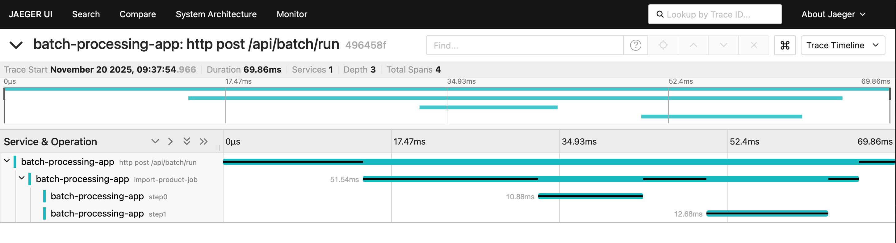
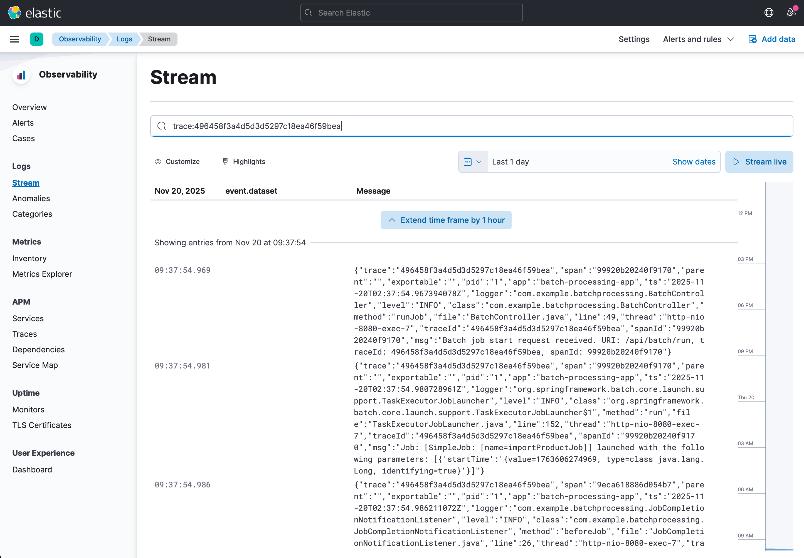

# Настройка трейсинга

- Добавлен трейсинг с Jaeger через OpenTelemetry
- BatchController логирует запросы с traceId, spanId, URI
- Создан Python клиент для вызова API
- Jaeger добавлен в docker-compose.yml

## Запуск

```shell
cd complete
./gradlew build
docker compose up --build -d
```

## Пробный запрос

```shell
uv venv
uv pip install -r requeriments.txt
uv run python client.py
```
```
Запуск batch job
Статус ответа: 200
Время выполнения: 0.078 сек

Ответ от сервера:
traceId   : 496458f3a4d5d3d5297c18ea46f59bea
spanId    : 99920b20240f9170
message   : Batch job started successfully
status    : success
timestamp : 1763606275036

Трейс в Jaeger UI: http://localhost:16686/trace/496458f3a4d5d3d5297c18ea46f59bea

Batch job успешно запущен!
```

## Результат

### Jaeger UI

http://localhost:16686/trace/496458f3a4d5d3d5297c18ea46f59bea



### Kibana

http://localhost:5601 (фильтр: trace:496458f3a4d5d3d5297c18ea46f59bea)


